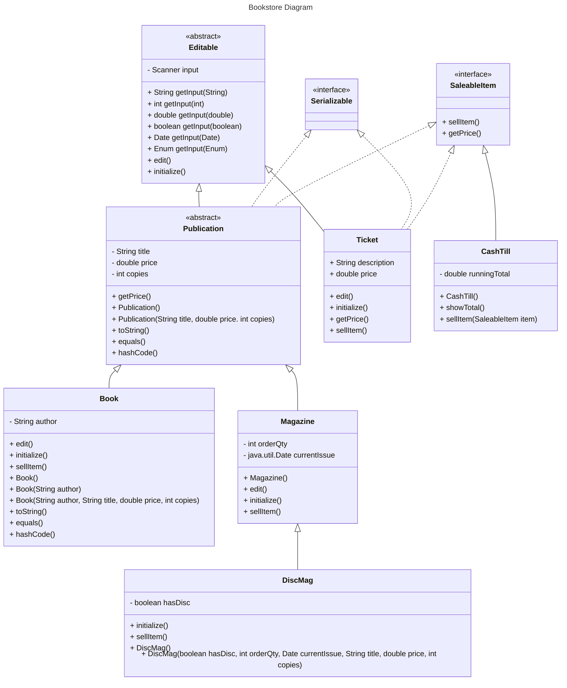

```mermaid
---
title: Bookstore Diagram
---
classDiagram

    Editable <|-- Publication
    Editable <|-- Ticket
    Serializable <|.. Ticket
    Serializable <|.. Publication
    SaleableItem <|-- CashTill
    SaleableItem <|.. Ticket
    SaleableItem <|.. Publication
    Publication <|-- Book
    Publication <|-- Magazine
    Magazine <|-- DiscMag
    
    Class SaleableItem
    <<interface>> SaleableItem
    SaleableItem: + sellItem()
    SaleableItem: + getPrice()
    
    Class Serializable
    <<interface>> Serializable
    
    Class Editable
    <<abstract>> Editable
    Editable: - Scanner input
    Editable: + String getInput(String)
    Editable: + int getInput(int)
    Editable: + double getInput(double)
    Editable: + boolean getInput(boolean)
    Editable: + Date getInput(Date)
    Editable: + Enum getInput(Enum)
    Editable: + edit()
    Editable: + initialize()
    
    class Publication
    <<abstract>> Publication
    Publication: - String title
    Publication: - double price
    Publication: - int copies
    Publication: + getPrice()
    Publication: + Publication()
    Publication: + Publication(String title, double price. int copies)
    Publication: + toString()
    Publication: + equals()
    Publication: + hashCode()
    
    Class CashTill
    CashTill: - double runningTotal
    CashTill: + CashTill()
    CashTill: + showTotal()
    CashTill: + sellItem(SaleableItem item)
    
    Class Ticket
    Ticket: + String description
    Ticket: + double price
    Ticket: + edit()
    Ticket: + initialize()
    Ticket: + getPrice()
    Ticket: + sellItem()
    
    Class Book
    Book: - String author
    Book: + edit()
    Book: + initialize()
    Book: + sellItem()
    Book: + Book()
    Book: + Book(String author)
    Book: + Book(String author, String title, double price, int copies)
    Book: + toString()
    Book: + equals()
    Book: + hashCode()
    
    Class Magazine
    Magazine: - int orderQty
    Magazine: - java.util.Date currentIssue
    Magazine: + Magazine()
    Magazine: + edit()
    Magazine: + initialize()
    Magazine: + sellItem()
    
    Class DiscMag
    DiscMag: - boolean hasDisc
    DiscMag: + initialize()
    DiscMag: + sellItem()
    DiscMag: + DiscMag()
    DiscMag: + DiscMag(boolean hasDisc, int orderQty, Date currentIssue, String title, double price, int copies)


```
